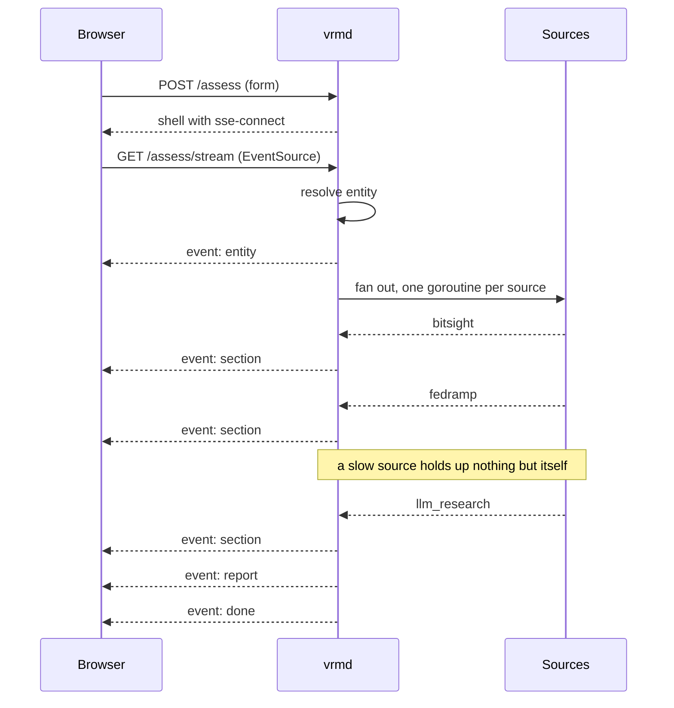
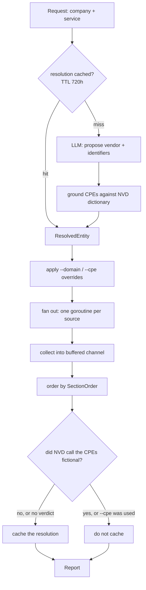
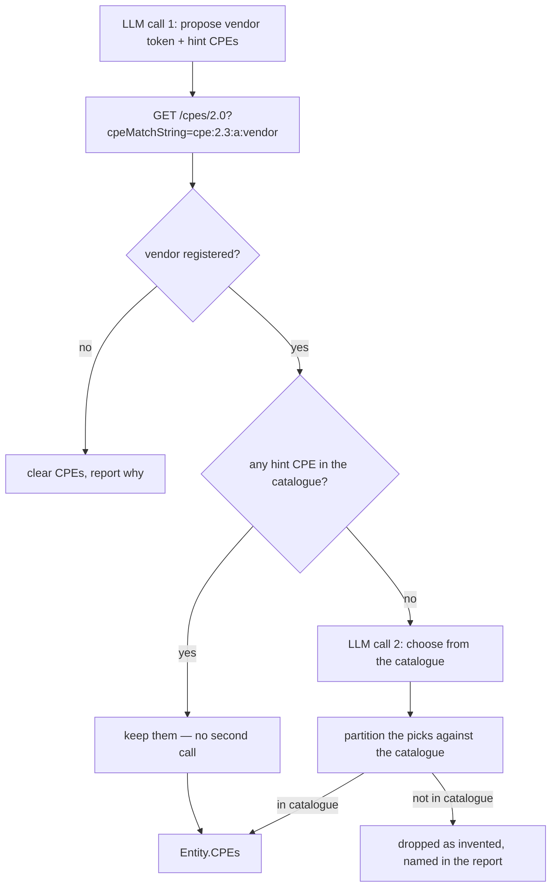

# vrm — vendor risk assessment

Query a vendor by **company** and **service**. `vrm` resolves that to machine identifiers
(domain, CPE, package), queries a fixed set of sources concurrently, and returns a sourced
report in a terminal or a browser.

> Solely decision-support. It only surfaces sourced facts.

## Prerequisites

- **Go 1.26+**
- **Docker** — runs the Postgres cache
- **`ANTHROPIC_API_KEY`** — entity resolution and checklist research
- **`BITSIGHT_API_KEY`** — security ratings

`NVD_API_KEY` is optional: it lifts NVD's rate limit from 5 to 50 requests per 30s.

## Quick start

```bash
docker compose up -d       # Postgres on host port 5433
cp .env.example .env       # fill in ANTHROPIC_API_KEY and BITSIGHT_API_KEY
```

`DATABASE_URL` in `.env.example` already points at the compose Postgres

Then either front-end:

```bash
go run ./cmd/vrm assess "Okta" --service "SSO"    # terminal
go run ./cmd/vrmd                                 # browser, http://localhost:8080
```

## CLI

```
vrm assess "<company>" --service "<service>" [flags]
vrm set    "<company>" --service "<service>" --source <name> --value "<text>"
```

| Flag | Effect |
|---|---|
| `--service` | required |
| `--domain` | override the resolved domain (BitSight) |
| `--cpe` | override the resolved CPEs (NVD), comma-separated |
| `--no-cache` | re-query automated sources; analyst entries are never cleared |
| `--full` | print every detail row instead of capping long lists |
| `--config` | config file path (default `config.yaml`) |

The report opens with the identifiers, then a summary:

```
summary
  9 categories: 6 answered, 1 failed, 1 unanswered, 1 awaiting a manual check
  failed:     bitsight
  unanswered: osv
  awaiting:   ssllabs
```

`unanswered`: gap in data
`awaiting manual check` task for analyst

Long lists cap at ten rows (ex. `… +12 more (use --full)`)

Record a manual answer and it renders verbatim from then on:

```bash
go run ./cmd/vrm set "Okta" --service "SSO" --source ssllabs --value "A+"
```

## Web

`go run ./cmd/vrmd` serves a form and a report on `config.yaml`'s `listen` (`:8080`), or pass `--listen`. 

## Configuration

Non-secret settings live in `config.yaml`: models, source toggles, cache TTLs, timeouts,
manual-source definitions, listen address.

| Variable | Required | Purpose |
|---|---|---|
| `DATABASE_URL` | yes | Postgres cache |
| `ANTHROPIC_API_KEY` | yes | entity resolution, checklist research |
| `BITSIGHT_API_KEY` | yes | security ratings |
| `NVD_API_KEY` | no | raises NVD's rate limit |

## Sources

| Source | Keyed on | Returns |
|---|---|---|
| BitSight | domain | security rating, industry comparison |
| NVD | CPE 2.3 | CVEs with CVSS scores + severity counts |
| OSV | package + ecosystem | advisories for vendor-published OSS |
| FedRAMP | company name | authorization status per offering (scrape) |
| CA Attorney General | company name | California-reported breaches (scrape) |
| LLM research | company + service | checklist, every claim cited |
| CVE Details, SSL Labs, Open Bug Bounty | — | manual by design — `vrm set` |

**Important:** BitSight's company directory is global but ratings are entitlement-scoped, so a
vendor outside of a subscription returns HTTP 403.

## Development

```bash
go build ./...
go vet ./...
go test -race ./...     # always -race; the fan-out is concurrent
gofmt -l .              # -w to fix
```

## Architecture

```
cmd/vrm            CLI (assess, set)
cmd/vrmd           web server
internal/assess    the pipeline: resolve → fan out → aggregate → record
internal/sources   one file per source, behind a common Source interface
internal/store     Postgres cache and analyst-supplied manual entries
internal/report    terminal renderer + the outcome/summary logic both UIs share
internal/web       handlers, SSE stream, embedded templates
```

Both front-ends call `assess.Runner.Run`. The Runner is built once per process and owns the
single shared `*sources.NVD` — the rate limiter is a field on it, so two instances would split
one 5-req/30s budget and earn a 403 that looks like a bad credential.

### Endpoints

| Method | Path | Returns |
|---|---|---|
| `GET` | `/` | the form (full page, loads htmx + the SSE extension) |
| `POST` | `/assess` | an HTML shell whose `sse-connect` points at the stream — runs nothing |
| `GET` | `/assess/stream` | `text/event-stream`; runs the assessment |

`POST` runs nothing because `EventSource` can only issue a `GET`. It validates what it can
while it can still return a plain error — once the stream is open the response is committed.
Query params: `company`, `service`, `domain`, `cpe`, `no_cache`.

The stream emits four event types:

| Event | Payload | Swap |
|---|---|---|
| `entity` | resolved identifiers | `innerHTML` into `#stream-entity` |
| `section` | one rendered section | `beforeend` into `#stream-sections` |
| `report` | the finished report | `outerHTML` — replaces the whole region |
| `done` | empty | closes the connection |

Sections arrive in completion order; the final `report` re-renders everything in
`SectionOrder` with the summary and config. Payloads are split across `data:` lines — a bare
newline terminates a field in the SSE wire format, and every fragment here is multi-line.

Time runs downward. Solid arrows are requests, dashed arrows are what comes back.



### Assessment pipeline



The fan-out uses no error-cancelling group: one source failing must not cancel its siblings.
The channel is buffered to one slot per source so the collector can walk away from a source
that ignores its context, rather than leaking the goroutine forever.

Resolution is cached only *after* the fan-out, because the question "are these CPEs real" is
answered by the source that consumes them. Only a *negative* verdict blocks the write — NVD
being disabled or unable to answer falls back to caching whatever has CPEs, since an
unvalidated CPE that turns out wrong produces a loud failed section every run, where an absent
one produced a silent skip.

### CPE resolution

The model never writes a product token. It proposes a vendor; NVD's dictionary supplies the
products; the model picks from that list; every pick is checked for membership.



A token outside the catalogue is dropped *and named* — a silently discarded identifier looks
exactly like a vendor that never had one. A truncated catalogue says so, because it makes
"nothing matched" a weaker claim.

### Caching

One table, `assessments_cache`, keyed `(company, service, source)`. It holds two different JSON
shapes discriminated by a `manual` boolean; every read and write filters on it in both
directions.

| Key | TTL | Notes |
|---|---|---|
| `resolution` | 720h | entity mapping is near-static |
| `bitsight`, `nvd`, `osv` | 24h | |
| `fedramp`, `caag`, `llm_research` | 168h | research is the most expensive call |
| manual entries | never | analyst data, not cache — `--no-cache` never clears them |

Two rules that aren't obvious from the schema:

- **Only successful sections are cached.** A failure is a fact about the run, not the vendor;
  caching one pins an upstream blip for the whole TTL and nothing distinguishes it from a live
  failure.
- **Rows record the identifiers they were computed from.** Each source registers which entity
  fields it reads; those are fingerprinted into the stored payload, and a row whose fingerprint
  disagrees with the current run is a miss. Without it, `--cpe` silently returned the CVEs for
  the CPEs you were overriding.

### Outbound calls

| Source | Endpoint | Auth |
|---|---|---|
| BitSight | `api.bitsighttech.com/ratings/v1/companies/search`, then `/companies/{guid}` | Basic, token as username |
| NVD | `services.nvd.nist.gov/rest/json/cves/2.0`, `/cpes/2.0` | optional API key header |
| OSV | `api.osv.dev/v1/query` | none |
| FedRAMP | `www.fedramp.gov/marketplace/products/` | none (scrape) |
| CA AG | `oag.ca.gov/privacy/databreach/list` | none (scrape) |
| Anthropic | Messages API — resolution ×2, research ×1 | `ANTHROPIC_API_KEY` |

Every automated source is a passive lookup against an existing database. `vrm` never scans or
probes vendor infrastructure.

### Notes

**Partial failure is normal.** One source failing marks that section and nothing else.

**"We found nothing" and "we couldn't look" are different claims,** and they render
identically if you're careless. NVD answers `200 / totalResults 0` both for a clean vendor and
for a CPE that doesn't exist. The FedRAMP scrape checks how many records it parsed before
calling a vendor unlisted. Research citations are matched against the URLs the search tool
actually returned, and an unmatched one is dropped as fabricated.
